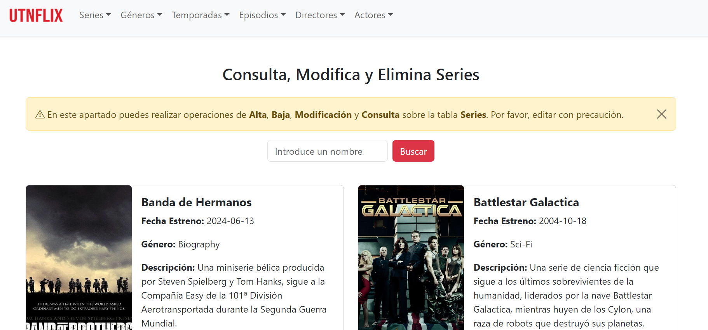
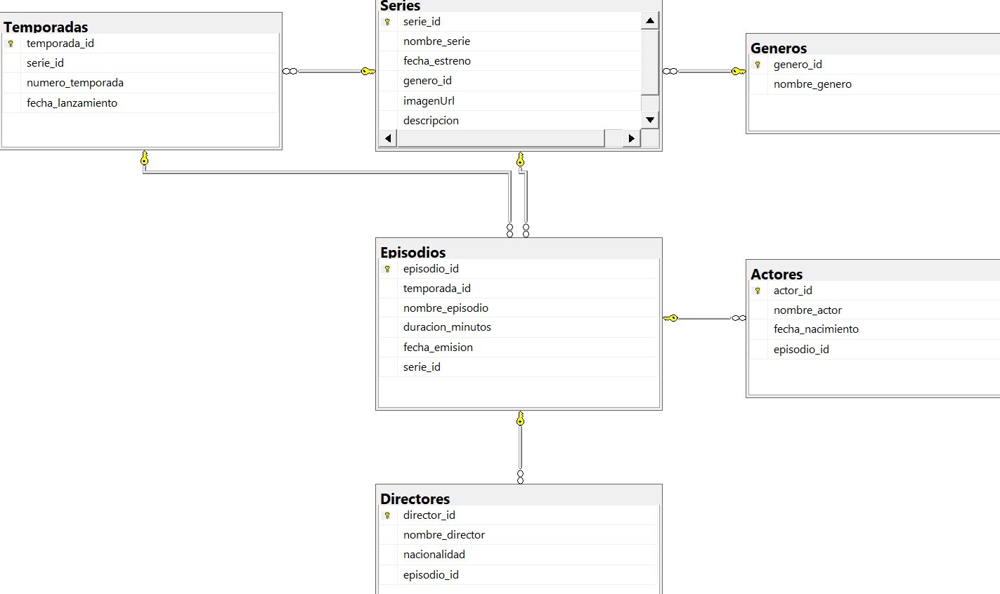
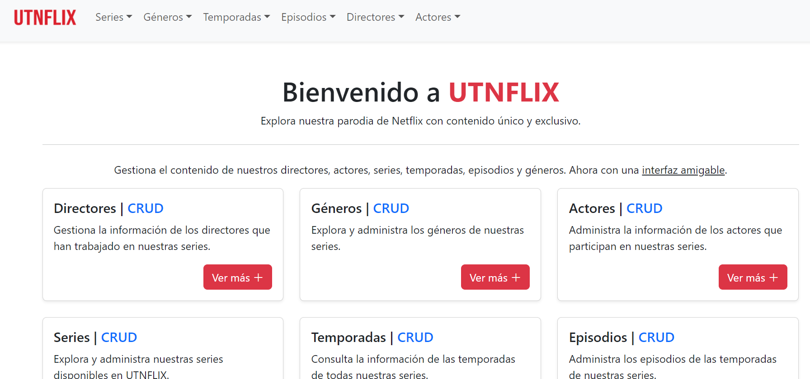
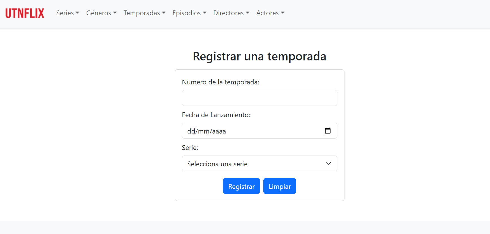
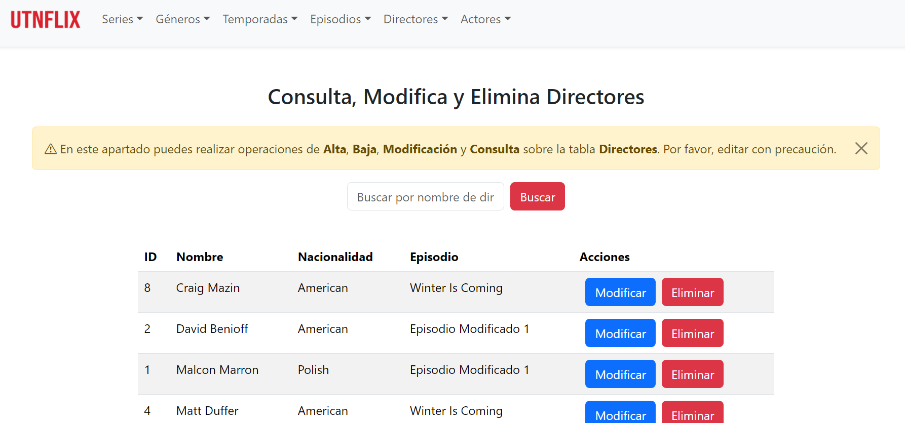
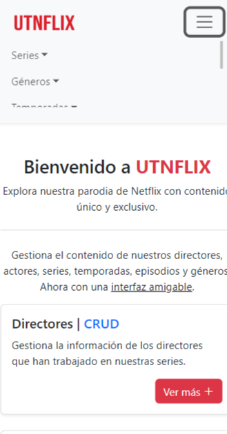

# Node.js and React REST API for Resource Management (UTNFLIX)

**Duration:** Mar 2024 - Jun 2024

## Description
This project is a REST API developed collaboratively for resource management using Node.js, Express, Sequelize, and SQLite. The application features a single relational database and provides comprehensive CRUD (Create, Read, Update, Delete) endpoints for efficient resource administration.

## Key Features
- REST API: Implementation of an API that enables seamless resource management through CRUD operations.
- React Frontend: Creation of a user-friendly interface that interacts with the API, facilitating filtered searches and pagination for better user experience.
- Code Management: Utilization of GitLab and GitHub for version control and enhanced team collaboration.
- API Testing: Leveraged Postman for thorough testing and validation of API endpoints, ensuring reliability.
- Database Management: Employed tools like DB Browser and SQL Server Management to manage and optimize the database effectively.
- Technologies: Frontend developed with React, React Router, Axios, and Bootstrap, ensuring an efficient and aesthetically pleasing user experience.
- Linux Environment: Developed in a Linux environment using Visual Studio Code and the bash terminal for task automation and project execution.
- Scalability: Designed to scale with future enhancements and increased resource management needs.
- Security: Implemented basic security measures to safeguard API endpoints and user data.

## Photos

## Video

Check out the project demo [here](project-assets/video/video.mp4).
